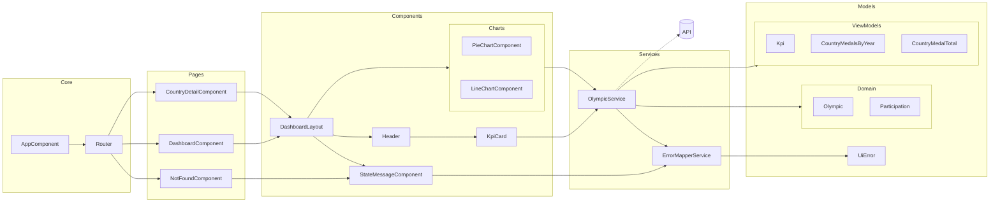

# ARCHITECTURE.md

## Objectif

Ce projet Angular affiche des statistiques sur les médailles olympiques via 2 pages :

- un Dashboard (page d’accueil) avec KPIs et un graphique “pie” (totaux par pays) ;
- une page de détail pays sur `/country/:id` avec KPIs et un graphique “line” (évolution par année).  
   L’objectif de l’architecture actuelle est de séparer clairement :
- les pages (conteneurs) ;
- les composants UI réutilisables ;
- la logique de récupération/transformation des données dans un service unique ;
- les modèles TypeScript (interfaces) pour supprimer les `any`.

## Prérequis validés

- Données externalisées dans un service (`OlympicService`) qui centralise la lecture JSON + les transformations.
- Application testée manuellement après refactor (navigation Dashboard → Détail → retour, route invalide, rendu des charts).

## Arborescence des fichiers (depuis `src`)

```text
src
├── app
│   ├── app-routing.module.ts
│   ├── app.component.html
│   ├── app.component.scss
│   ├── app.component.spec.ts
│   ├── app.component.ts
│   ├── app.module.ts
│   ├── components
│   │   ├── charts
│   │   │   ├── line-chart
│   │   │   │   ├── line-chart.component.html
│   │   │   │   ├── line-chart.component.scss
│   │   │   │   ├── line-chart.component.spec.ts
│   │   │   │   └── line-chart.component.ts
│   │   │   └── pie-chart
│   │   │       ├── pie-chart.component.html
│   │   │       ├── pie-chart.component.scss
│   │   │       ├── pie-chart.component.spec.ts
│   │   │       └── pie-chart.component.ts
│   │   ├── header
│   │   │   ├── header.component.html
│   │   │   ├── header.component.scss
│   │   │   ├── header.component.spec.ts
│   │   │   └── header.component.ts
│   │   ├── kpi-card
│   │   │   ├── kpi-card.component.html
│   │   │   ├── kpi-card.component.scss
│   │   │   ├── kpi-card.component.spec.ts
│   │   │   └── kpi-card.component.ts
│   │   └── layouts
│   │       └── dashboard-layout
│   │           ├── dashboard-layout.component.html
│   │           ├── dashboard-layout.component.scss
│   │           ├── dashboard-layout.component.spec.ts
│   │           └── dashboard-layout.component.ts
│   ├── models
│   │   ├── CountryMedalTotal.ts
│   │   ├── CountryMedalsByYear.ts
│   │   ├── kpi.model.ts
│   │   ├── olympic.model.ts
│   │   └── participation.model.ts
│   ├── pages
│   │   ├── country-detail
│   │   │   ├── country-detail.component.html
│   │   │   ├── country-detail.component.scss
│   │   │   ├── country-detail.component.spec.ts
│   │   │   └── country-detail.component.ts
│   │   ├── dashboard
│   │   │   ├── dashboard.component.html
│   │   │   ├── dashboard.component.scss
│   │   │   ├── dashboard.component.spec.ts
│   │   │   └── dashboard.component.ts
│   │   └── not-found
│   │       ├── not-found.component.html
│   │       ├── not-found.component.scss
│   │       ├── not-found.component.spec.ts
│   │       └── not-found.component.ts
│   └── services
│       ├── olympic.service.spec.ts
│       └── olympic.service.ts
├── assets
│   ├── .gitkeep
│   ├── images
│   │   └── teleSport.png
│   └── mock
│       └── olympic.json
├── environments
│   ├── environment.prod.ts
│   └── environment.ts
├── favicon.ico
├── index.html
├── main.ts
├── polyfills.ts
├── styles.scss
└── test.ts
```

## Diagramme d’architecture



## Rôles des dossiers

- `pages/` : composants “conteneurs” liés au routage. Ils orchestrent la page (récupération de données via service + passage aux composants UI).
- `components/` : composants présentations/réutilisables (layout, header, cartes KPI, charts).
- `services/` : logique de données centralisée (lecture, cache, transformations, règles de calcul).
- `models/` : contrats TypeScript (interfaces) utilisés par le service et les composants pour typer les données.
- `assets/mock/` : données simulées (JSON). Remplaçable plus tard par une API.

## Pages et responsabilités

### Dashboard (`DashboardComponent`)

- Rôle : page d’accueil, récupère les KPIs globaux + totaux par pays.
- Données chargées :
  - `getDashboardKpis()` → `Kpi[]`
  - `getMedalTotalsByCountry()` → `CountryMedalTotal[]`
- Composition :
  - utilise `DashboardLayoutComponent` pour uniformiser la structure (header + zone de contenu via `ng-content`) ;
  - injecte les données dans `PieChartComponent` via `@Input()`.

### Détail pays (`CountryDetailComponent`)

- Rôle : afficher les KPIs d’un pays et l’évolution des médailles par année.
- Lecture route :
  - récupère `id` depuis `ActivatedRoute` sur `/country/:id`.
- Validation :
  - appelle `getCountryDetailById(id)` ; si pays non trouvé → redirection vers `/`.
- Données chargées :
  - `getCountryKpis(id)` → `Kpi[]`
  - `getCountryMedalsByYear(id)` → `CountryMedalsByYear[]`
- Composition :
  - même layout réutilisé via `DashboardLayoutComponent` ;
  - données injectées dans `LineChartComponent` via `@Input()`.

### Page 404 (`NotFoundComponent`)

- Rôle : afficher un état simple “page introuvable” et proposer un retour à la home.
- Routage :
  - route `not-found` et wildcard `**` pointent vers ce composant.

## Composants réutilisables

### `DashboardLayoutComponent`

- Rôle : factoriser la structure commune “header + contenu”.
- API :
  - `@Input() titlePage: string`
  - `@Input() kpis: Kpi[]`
- Template :
  - affiche le `HeaderComponent` puis projette le contenu avec `<ng-content>`.

### `HeaderComponent`

- Rôle : afficher un titre et une liste de KPIs.
- API :
  - `@Input() titlePage: string`
  - `@Input() kpis: Kpi[]`
- Affichage :
  - itère sur les KPIs (syntaxe `@for`) et délègue le rendu d’une carte à `KpiCardComponent`.

### `KpiCardComponent`

- Rôle : afficher un indicateur simple (label + value).
- API :
  - `@Input() kpi: Kpi`

### Charts (`PieChartComponent`, `LineChartComponent`)

- Rôle : transformer des données déjà prêtes en graphique Chart.js, sans dépendre du routage ni du service directement.
- API :
  - `PieChartComponent`: `@Input() data: CountryMedalTotal[]`
  - `LineChartComponent`: `@Input() data: { year: number; medals: number }[]`
- Cycle de vie :
  - `ngOnChanges`: (re)rend le chart quand `data` devient disponible.
  - `ngOnDestroy`: détruit le chart pour éviter fuites mémoire / doublons.
- Navigation (PieChart) :
  - clique sur une portion du pie → navigation vers `/country/:id` en réutilisant l’`id` stocké dans le modèle fourni au chart.

## Service Angular et rôle (centralisation de la logique)

### `OlympicService`

- Objectif : un point unique d’accès aux données et aux calculs métier.
- Source actuelle :
  - lit `./assets/mock/olympic.json` via `HttpClient`.
- Approche réactive (Observer Pattern) :
  - expose des `Observable<T>` ; les composants s’abonnent et “réagissent” quand les données arrivent.
  - met en cache le flux source avec `shareReplay(1)` via `olympics$` pour éviter de relire le JSON à chaque appel.
- Méthodes principales :
  - `getOlympics()` : données brutes typées (`Olympic[]`).
  - `getDashboardKpis()` : calcule nombre de pays + nombre d’éditions (via `Set` sur les années).
  - `getMedalTotalsByCountry()` : calcule le total des médailles par pays (reduce sur `participations.medalsCount`).
  - `getCountryDetailById(id)` : retrouve un pays par id.
  - `getCountryKpis(id)` : calcule participations, total médailles, total athlètes.
  - `getCountryMedalsByYear(id)` : map année → médailles pour alimenter le line chart.

## Modèles TypeScript

- `Olympic` et `Participation` : contrat de données conforme aux spécifications (structure du JSON).
- `Kpi` : modèle UI simple `{ label: string; value: number }`.
- `CountryMedalTotal` : modèle “Dashboard” `{ id; country; total }`.
- `CountryMedalsByYear` : modèle “Détail” `{ year; medals }`.  
   Note : dans ce code, `CountryMedalTotal.ts` et `CountryMedalsByYear.ts` sont des fichiers de modèle (même s’ils ne suivent pas le suffixe `.model.ts`).

## Préparation à une future connexion back-end / API

L’architecture est déjà prête à remplacer le mock JSON par une API REST, car :

- les pages ne connaissent pas la source des données ; elles dépendent uniquement des méthodes du service ;
- la majorité des règles de calcul (KPIs, agrégations) est déjà isolée dans `OlympicService`.  
   Évolution typique :
- remplacer `olympicUrl` (assets) par des endpoints (`/api/olympics`, `/api/country/{id}`, etc.) dans `OlympicService` ;
- conserver les mêmes signatures publiques (`Observable<...>`) pour limiter l’impact sur les composants ;
- ajouter progressivement :
  - gestion d’erreurs unifiée (ex: `ErrorMapperService` + modèle `UiError`) ;
  - états UI standardisés (loading/empty/error) via un composant dédié (ex: `StateMessageComponent`) ;
  - éventuellement un `HttpInterceptor` (logs, gestion erreurs, base URL, retry).

## Points d’attention et améliorations possibles

Plusieurs axes d’amélioration peuvent être envisagés afin de renforcer la maintenabilité, la cohérence de l’interface et l’expérience utilisateur.

- **Gestion des flux de données**  
  Les pages utilisent actuellement plusieurs `subscribe()` directement dans les composants. Une évolution possible consisterait à exposer davantage d’`Observable` et à utiliser l’`async` pipe dans les templates afin de simplifier la gestion des flux et améliorer la maintenabilité du code.

- **Structuration des données dans les pages**  
  Certains appels de données pourraient être regroupés afin de construire les informations nécessaires à l’affichage (titre, indicateurs et données du graphique) à partir d’un flux unique, ce qui rendrait la logique des pages plus claire et plus cohérente.

- **Cohérence du code et de l’arborescence**  
  Le nommage des modèles pourrait être uniformisé (par exemple `CountryMedalTotal.model.ts`, `MedalByYear.model.ts`) afin d’améliorer la lisibilité de l’arborescence et la compréhension du rôle de chaque type. Un travail progressif de nettoyage et de factorisation du code peut également être poursuivi pour renforcer la clarté et la maintenabilité de l’application.

- **Amélioration de l’interface utilisateur**  
  L’interface pourrait être enrichie afin de mieux présenter le contexte de l’application et améliorer la lisibilité générale (texte de présentation du dashboard, hiérarchie visuelle plus claire, mise en valeur des indicateurs et des graphiques).

- **Navigation et gestion des états**  
  Le routing et la gestion des états pourraient être renforcés afin de rendre la navigation plus robuste et plus explicite pour l’utilisateur (gestion des erreurs, affichage des états _loading_, _empty_ ou _error_, gestion des routes invalides).

- **Responsivité de l’interface**  
  Enfin, la mise en page peut être améliorée afin de garantir une expérience fluide sur ordinateur, tablette et mobile, conformément aux attentes du cahier des charges qui prévoit une interface responsive et accessible.
