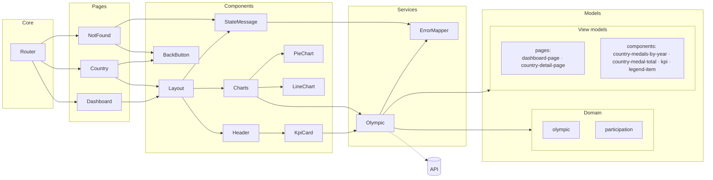

# ARCHITECTURE.md

## Objectif

Ce projet Angular affiche des statistiques sur les médailles olympiques via 2 pages :

- un Dashboard (page d’accueil) avec KPIs et un graphique “pie” (totaux par pays) ;
- une page de détail pays sur `/country/:id` avec KPIs et un graphique “line” (évolution par année).  
   L’objectif de l’architecture actuelle est de séparer clairement :
- les pages (conteneurs) ;
- les composants UI réutilisables ;
- la logique de récupération/transformation des données dans un service unique ;
- les modèles TypeScript (interfaces) pour supprimer les `any`.

## Prérequis validés

- Données externalisées dans un service (`OlympicService`) qui centralise la lecture JSON + les transformations.
- Application testée manuellement après refactor (navigation Dashboard → Détail → retour, route invalide, rendu des charts).

## Arborescence des fichiers (depuis `src`)

```text
src
├── app
│   ├── app-routing.module.ts
│   ├── app.component.html
│   ├── app.component.scss
│   ├── app.component.spec.ts
│   ├── app.component.ts
│   ├── app.module.ts
│   ├── components
│   │   ├── charts
│   │   │   ├── line-chart
│   │   │   │   ├── line-chart.component.html
│   │   │   │   ├── line-chart.component.scss
│   │   │   │   ├── line-chart.component.spec.ts
│   │   │   │   └── line-chart.component.ts
│   │   │   └── pie-chart
│   │   │       ├── pie-chart-colors.ts
│   │   │       ├── pie-chart-config.factory.ts
│   │   │       ├── pie-chart.component.html
│   │   │       ├── pie-chart.component.scss
│   │   │       ├── pie-chart.component.spec.ts
│   │   │       ├── pie-chart.component.ts
│   │   │       └── pie-labels-line.plugin.ts
│   │   ├── dashboard-header
│   │   │   ├── dashboard-header.component.html
│   │   │   ├── dashboard-header.component.scss
│   │   │   ├── dashboard-header.component.spec.ts
│   │   │   └── dashboard-header.component.ts
│   │   ├── kpi-card
│   │   │   ├── kpi-card.component.html
│   │   │   ├── kpi-card.component.scss
│   │   │   ├── kpi-card.component.spec.ts
│   │   │   └── kpi-card.component.ts
│   │   ├── layouts
│   │   │   └── dashboard-layout
│   │   │       ├── dashboard-layout.component.html
│   │   │       ├── dashboard-layout.component.scss
│   │   │       ├── dashboard-layout.component.spec.ts
│   │   │       └── dashboard-layout.component.ts
│   │   └── ui
│   │       ├── back-button
│   │       │   ├── back-button.component.html
│   │       │   ├── back-button.component.scss
│   │       │   ├── back-button.component.spec.ts
│   │       │   └── back-button.component.ts
│   │       └── state-message
│   │           ├── state-message.component.html
│   │           ├── state-message.component.scss
│   │           ├── state-message.component.spec.ts
│   │           └── state-message.component.ts
│   ├── models
│   │   ├── domain
│   │   │   ├── olympic.model.ts
│   │   │   └── participation.model.ts
│   │   └── view-models
│   │       ├── components
│   │       │   ├── country-medal-total.vm.ts
│   │       │   ├── country-medals-by-year.vm.ts
│   │       │   ├── kpi.vm.ts
│   │       │   └── legend-item.vm.ts
│   │       └── pages
│   │           ├── country-detail-page.vm.ts
│   │           └── dashboard-page.vm.ts
│   ├── pages
│   │   ├── country-detail
│   │   │   ├── country-detail.component.html
│   │   │   ├── country-detail.component.scss
│   │   │   ├── country-detail.component.spec.ts
│   │   │   └── country-detail.component.ts
│   │   ├── dashboard
│   │   │   ├── dashboard.component.html
│   │   │   ├── dashboard.component.scss
│   │   │   ├── dashboard.component.spec.ts
│   │   │   └── dashboard.component.ts
│   │   └── not-found
│   │       ├── not-found.component.html
│   │       ├── not-found.component.scss
│   │       ├── not-found.component.spec.ts
│   │       └── not-found.component.ts
│   └── services
│       ├── error-mapper.service.spec.ts
│       ├── error-mapper.service.ts
│       ├── olympic.service.spec.ts
│       └── olympic.service.ts
├── assets
│   ├── .gitkeep
│   ├── images
│   │   └── teleSport.png
│   └── mock
│       ├── olympic.json
│       ├── olympic.5.json
│       ├── olympic.40.json
│       └── olympic.empty.json
├── environments
│   ├── environment.development.ts
│   └── environment.ts
├── favicon.ico
├── index.html
├── main.ts
├── polyfills.ts
├── styles.scss
└── test.ts
```

## Diagramme d’architecture



## Rôles des dossiers

- `pages/` : composants “conteneurs” liés au routage. Ils orchestrent la page (récupération de données via service + passage aux composants UI).
- `components/` : composants présentations/réutilisables (layout, header, cartes KPI, charts).
- `services/` : logique de données centralisée (lecture, cache, transformations, règles de calcul).
- `models/` : contrats TypeScript (interfaces) utilisés par le service et les composants pour typer les données.
- `assets/mock/` : données simulées (JSON). Remplaçable plus tard par une API.

## Pages et responsabilités

### Dashboard (`DashboardComponent`)

- Rôle : page d’accueil, récupère les KPIs globaux + totaux par pays.
- Données chargées :
  - `getDashboardKpis()` → `Kpi[]`
  - `getMedalTotalsByCountry()` → `CountryMedalTotal[]`
- Composition :
  - utilise `DashboardLayoutComponent` pour uniformiser la structure (header + zone de contenu via `ng-content`) ;
  - injecte les données dans `PieChartComponent` via `@Input()`.

### Détail pays (`CountryDetailComponent`)

- Rôle : afficher les KPIs d’un pays et l’évolution des médailles par année.
- Lecture route :
  - récupère `id` depuis `ActivatedRoute` sur `/country/:id`.
- Validation :
  - appelle `getCountryDetailById(id)` ; si pays non trouvé → redirection vers `/`.
- Données chargées :
  - `getCountryKpis(id)` → `Kpi[]`
  - `getCountryMedalsByYear(id)` → `CountryMedalsByYear[]`
- Composition :
  - même layout réutilisé via `DashboardLayoutComponent` ;
  - données injectées dans `LineChartComponent` via `@Input()`.

### Page 404 (`NotFoundComponent`)

- Rôle : afficher un état simple “page introuvable” et proposer un retour à la home.
- Routage :
  - route `not-found` et wildcard `**` pointent vers ce composant.

## Composants réutilisables

### `DashboardLayoutComponent`

- Rôle : factoriser la structure commune “header + contenu”.
- API :
  - `@Input() titlePage: string`
  - `@Input() kpis: Kpi[]`
- Template :
  - affiche le `DashboardHeaderComponent` puis projette le contenu avec `<ng-content>`.

### `DashboardHeaderComponent`

- Rôle : afficher un titre et une liste de KPIs.
- API :
  - `@Input() titlePage: string`
  - `@Input() kpis: Kpi[]`
- Affichage :
  - itère sur les KPIs (syntaxe `@for`) et délègue le rendu d’une carte à `KpiCardComponent`.

### `KpiCardComponent`

- Rôle : afficher un indicateur simple (label + value).
- API :
  - `@Input() kpi: Kpi`

### Charts (`PieChartComponent`, `LineChartComponent`)

- Rôle : transformer des données déjà prêtes en graphique Chart.js, sans dépendre du routage ni du service directement.
- API :
  - `PieChartComponent`: `@Input() data: CountryMedalTotal[]`
  - `LineChartComponent`: `@Input() data: { year: number; medals: number }[]`
- Cycle de vie :
  - `ngOnChanges`: (re)rend le chart quand `data` devient disponible.
  - `ngOnDestroy`: détruit le chart pour éviter fuites mémoire / doublons.
- Navigation (PieChart) :
  - clique sur une portion du pie → navigation vers `/country/:id` en réutilisant l’`id` stocké dans le modèle fourni au chart.

## Service Angular et rôle (centralisation de la logique)

### `OlympicService`

- Objectif : un point unique d’accès aux données et aux calculs métier.
- Source actuelle :
  - lit `./assets/mock/olympic.json` via `HttpClient`.
- Approche réactive (Observer Pattern) :
  - expose des `Observable<T>` ; les composants s’abonnent et “réagissent” quand les données arrivent.
  - met en cache le flux source avec `shareReplay(1)` via `olympics$` pour éviter de relire le JSON à chaque appel.
- Méthodes principales :
  - `getOlympics()` : données brutes typées (`Olympic[]`).
  - `getDashboardKpis()` : calcule nombre de pays + nombre d’éditions (via `Set` sur les années).
  - `getMedalTotalsByCountry()` : calcule le total des médailles par pays (reduce sur `participations.medalsCount`).
  - `getCountryDetailById(id)` : retrouve un pays par id.
  - `getCountryKpis(id)` : calcule participations, total médailles, total athlètes.
  - `getCountryMedalsByYear(id)` : map année → médailles pour alimenter le line chart.

## Modèles TypeScript

- `Olympic` et `Participation` (`models/domain/`) : contrat de données conforme aux spécifications (structure du JSON).
- `Kpi` (`kpi.vm.ts`), `CountryMedalTotal` (`country-medal-total.vm.ts`), `CountryMedalsByYear` (`country-medals-by-year.vm.ts`), `LegendItem` (`legend-item.vm.ts`) : view-models partagés entre composants (`models/view-models/components/`).
- `DashboardPageVm` (`dashboard-page.vm.ts`), `CountryDetailPageVm` (`country-detail-page.vm.ts`) : view-models agrégés par page (`models/view-models/pages/`), construits par le service et passés en entrée aux pages.

## Préparation à une future connexion back-end / API

L’architecture est déjà prête à remplacer le mock JSON par une API REST, car :

- les pages ne connaissent pas la source des données ; elles dépendent uniquement des méthodes du service ;
- la majorité des règles de calcul (KPIs, agrégations) est déjà isolée dans `OlympicService`.  
   Évolution typique :
- remplacer `olympicUrl` (assets) par des endpoints (`/api/olympics`, `/api/country/{id}`, etc.) dans `OlympicService` ;
- conserver les mêmes signatures publiques (`Observable<...>`) pour limiter l’impact sur les composants ;
- ajouter progressivement :
  - gestion d’erreurs unifiée (ex: `ErrorMapperService` + modèle `UiError`) ;
  - états UI standardisés (loading/empty/error) via un composant dédié (ex: `StateMessageComponent`) ;
  - éventuellement un `HttpInterceptor` (logs, gestion erreurs, base URL, retry).

## Points d'attention et améliorations possibles

Plusieurs axes d'amélioration ont été adressés au fil du développement. Les points restants concernent des évolutions à traiter dans un second temps, notamment lors de la connexion à une vraie API back-end (les données sont actuellement simulées via un mock JSON local).

### Points traités

- **Gestion des flux de données**  
  Les pages n'utilisent plus de `subscribe()` direct : chaque page expose un unique Observable `vm$` consommé via le pipe `async` dans le template.

- **Structuration des données dans les pages**  
  Les données de chaque page sont regroupées dans des view-models de page (`DashboardPageVm`, `CountryDetailPageVm`) construits par `OlympicService`, ce qui rend les pages déclaratives et sans logique de transformation.

- **Cohérence du code et de l'arborescence**  
  Les modèles sont réorganisés en `models/domain/` (contrats JSON) et `models/view-models/` (view-models composants et pages), tous suffixés en `.vm.ts`.

- **Amélioration de l'interface utilisateur**  
  Un texte de présentation est intégré au dashboard (section hero) afin de contextualiser l'application pour l'utilisateur.

- **Navigation et gestion des états**  
  `ErrorMapperService` centralise la traduction des erreurs HTTP. `StateMessageComponent` couvre les états _loading_, _error_ et _empty_. `BackButtonComponent` gère le retour arrière. Les IDs de route invalides sont détectés côté composant avant tout appel service.

### Améliorations à venir

> ⚠️ **En attente d'une vraie connexion API** — toutes les données proviennent actuellement d'un mock JSON local (`assets/mock/olympic.json`). La connexion à un back-end REST est requise pour valider et finaliser plusieurs des points ci-dessous.

- **État `empty` non encore utilisé**  
  `StateMessageComponent` supporte l'état `empty` mais il n'est pas encore déclenché (les listes vides n'en bénéficient pas). À brancher lorsque l'API pourra retourner des résultats vides distincts d'une erreur.

- **`HttpInterceptor`**  
  À ajouter pour centraliser la gestion des en-têtes (authentification, base URL), le retry automatique sur erreur réseau transitoire, et la journalisation des requêtes.

- **Accessibilité (a11y)**  
  Ajouter les attributs ARIA manquants (rôles, `aria-label` sur les graphiques Chart.js, navigation au clavier dans le pie-chart), et vérifier le contraste des couleurs.

- **Lisibilité du pie-chart avec un grand nombre de pays**  
  Au-delà de 25 pays environ, le pie-chart devient difficile à lire (portions trop petites, légende surchargée). Plusieurs approches peuvent être envisagées : limiter l'affichage aux N premiers pays, ajouter un filtre interactif, ou regrouper automatiquement les pays dont la part est inférieure à un seuil dans une section « Autres ». Ce dernier regroupement nécessite une adaptation du `PieChartComponent` (nouvelle entrée agrégée non cliquable) et de la logique dans `OlympicService` (`getMedalTotalsByCountry`).

- **Tests unitaires à compléter**  
  Les fichiers `.spec.ts` sont en place. Les tests des méthodes de `OlympicService`, des view-models de page et des composants UI (`StateMessageComponent`, `BackButtonComponent`) restent à écrire/enrichir.
