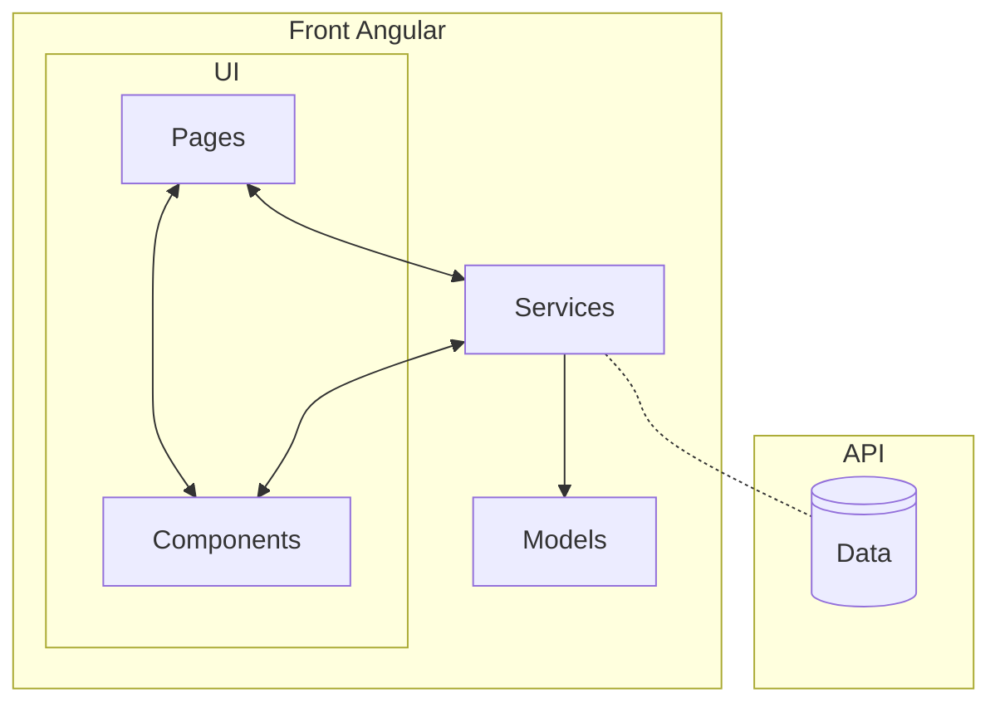

# Sommaire

> 1. État des lieux du starter code

    1.1 Description fonctionnelle actuelle
    1.2 Description technique actuelle
    1.3 Organisation et responsabilités actuelles

> 2.  Analyse des problématiques identifiées (priorisées)

    2.1 Problèmes critiques (impact fort / urgence élevée)
        2.1.1 Problèmes de structure
        2.1.2 Problèmes de typage
        2.1.3 Centralisation absente des données
        2.1.4 Gestion perfectible des observables
        2.1.5 Absence de gestion des cas d’erreur métier
    2.2 Problèmes majeurs (impact moyen)
        2.2.2 Problèmes d’organisation et de cohérence du projet
    2.3 Problèmes mineurs (impact faible)
        2.3.1 Code obsolète / console.log
        2.3.2 Nommage perfectible
        2.3.3 Lisibilité / cohérence
        2.3.4 Dépendances inutiles ou incohérentes

> 3.  Recommandations et proposition d’architecture cible

    3.1 Principes directeurs
        3.1.1 Séparation des responsabilités
        3.1.2 Centralisation et mutualisation des données
        3.1.3 Typage strict
        3.1.4 Gestion des cas métier
    3.2 Design patterns retenus
        3.2.1 Singleton
        3.2.2 Observer
    3.3 Blocs identifiés et responsabilités
        3.3.1 pages/
        3.3.2 components/
        3.3.3 services/
        3.3.4 models/
    3.4 Arborescence cible
    3.5 Schéma d’architecture simplifié
    3.6 Plan de refactorisation progressif

---

# 1. État des lieux du starter code

## 1.1 Description fonctionnelle actuelle

L’application propose :

- un Dashboard affichant les médailles par pays via un graphique ;
- une page de détail par pays accessible via le routing ;
- une navigation fonctionnelle entre les pages.

L’application démarre correctement avec `ng serve` et les fonctionnalités principales sont opérationnelles.

## 1.2 Description technique actuelle

Le projet est basé sur une architecture Angular **avec NgModules (non standalone)**.  
Le point d’entrée est `AppModule`, qui déclare les composants et configure le routing.

Caractéristiques principales :

- Pages principales : `HomeComponent`, `CountryComponent`, `NotFoundComponent`
- Chargement des données via `HttpClient` depuis un JSON local
- Utilisation de `Chart.js` pour les graphiques
- Tests unitaires générés par défaut (`*.spec.ts`)

Cependant :

- Les composants gèrent directement les appels HTTP.
- Les calculs métier sont réalisés dans les pages.
- Plusieurs variables sont typées en `any`.
- La logique métier et la logique d’affichage sont fortement couplées.

## 1.3 Organisation et responsabilités actuelles

Les pages cumulent plusieurs responsabilités :

- récupération des données ;
- transformation et agrégation ;
- génération des graphiques ;
- gestion de la navigation.

Il n’existe pas encore :

- de service centralisant l’accès aux données ;
- de modèles TypeScript pour structurer le typage ;
- de séparation claire entre composants conteneurs et composants réutilisables.

L’architecture actuelle fonctionne, mais elle n’est pas optimisée pour la maintenabilité ni pour une future intégration avec une API back-end.

---

# 2. Analyse des problématiques identifiées (priorisées)

## 2.1 Problèmes critiques (impact fort / urgence élevée)

### 2.1.1 Problèmes de structure

Les composants pages concentrent plusieurs responsabilités : lecture des paramètres de route, récupération des données, traitement métier et génération des graphiques.

Exemple dans `src/app/pages/country/country.component.ts:26-34` :

```ts
this.route.paramMap.subscribe((param: ParamMap) => (countryName = param.get('countryName')));
this.http.get<any[]>(this.olympicUrl).subscribe((data) => {
  const selectedCountry = data.find((c) => c.country === countryName);
  this.titlePage = selectedCountry.country;
});
```

Le composant gère simultanément :

- lecture du paramètre de route,
- récupération des données,
- recherche du pays,
- mise à jour de la vue.

Exemple supplémentaire dans `src/app/pages/home/home.component.ts:35` :

```ts
new Chart('myChart', { ... });
```

L’instanciation du graphique est réalisée directement dans la page, ce qui couple la logique d’affichage à la logique métier.

Ces éléments montrent l’absence de séparation claire entre :

- couche d’accès aux données,
- logique métier,
- composants d’affichage.

Cette organisation rend le code difficilement maintenable et peu évolutif.

### 2.1.2 Problèmes de typage

Usage répété de `any`, ce qui supprime la sécurité TypeScript.

Exemple dans `src/app/pages/home/home.component.ts:22` :

```ts
this.http.get<any[]>(this.olympicUrl);
```

Et dans `src/app/pages/country/country.component.ts:27` :

```ts
(data: any) => { ... }
```

Aucune interface `Olympic` ou `Participation` n’est utilisée pour structurer les données.

Impact : perte de contrôle sur la structure réelle des objets.

### 2.1.3 Centralisation absente des données

Les appels HTTP sont réalisés directement dans les pages.

Exemple dans `src/app/pages/home/home.component.ts:22-30` :

```ts
this.http.get<any[]>(this.olympicUrl).subscribe(
  (data) => { ... },
  (error: HttpErrorResponse) => { ... }
);
```

Il n’existe pas de `DataService` centralisant les données, contrairement aux spécifications.  
Cela empêche la mutualisation et la préparation à une API REST.

### 2.1.4 Gestion perfectible des observables

Les flux asynchrones (route + requête HTTP) sont gérés séparément et reposent sur une variable partagée (`countryName`), ce qui rend le comportement dépendant de l’ordre d’exécution.

Exemple dans `src/app/pages/country/country.component.ts:26-27` :

```ts
this.route.paramMap.subscribe((param: ParamMap) => (countryName = param.get('countryName')));

this.http.get<any[]>(this.olympicUrl).subscribe((data) => {
  const selectedCountry = data.find((i: any) => i.country === countryName);
});
```

Points problématiques :

- La requête HTTP renvoie l’ensemble des pays ; le pays affiché dépend de la valeur actuelle de `countryName` au moment où le `subscribe` s’exécute.
- Si l’utilisateur change rapidement de pays, la variable peut avoir changé entre le lancement de la requête et sa résolution.
- Les flux route et HTTP ne sont pas chaînés explicitement, ce qui rend la logique fragile.
- La signature `subscribe(next, error)` est utilisée au lieu de la forme recommandée `subscribe({ next, error })`.
- Présence de `pipe()` vide dans `home.component.ts`, ce qui n’apporte aucune transformation.
- Risque d’erreur runtime si `selectedCountry` est `undefined` (ex. paramètre invalide), l’erreur étant déclenchée dans le callback du `subscribe`.

Même si le projet fonctionne avec un JSON local rapide, cette gestion reste peu robuste et peu évolutive pour une future API réelle.

### 2.1.5 Absence de gestion des cas d’erreur métier

Le code ne gère pas explicitement les cas où les données attendues ne sont pas trouvées.

Exemple dans `src/app/pages/country/country.component.ts:29` :

```ts
this.titlePage = selectedCountry.country;
```

Si `selectedCountry` est `undefined` (paramètre invalide ou incohérence de données), une erreur runtime peut survenir.

Aucune redirection vers une page `not-found` ni message utilisateur structuré n’est prévu.

## 2.2 Problèmes majeurs (impact moyen)

### 2.2.2 Problèmes d’organisation et de cohérence du projet

- Absence de dossiers `services/` et `models/`
- Styles globaux dans `src/styles.scss` alors qu’ils concernent la structure (header/layout)
- Test incorrect dans `src/app/app.component.spec.ts:20` :
  ```ts
  expect(app.title).toEqual('olympic-games-starter');
  ```
  La propriété `title` n’existe pas dans `app.component.ts`.

## 2.3 Problèmes mineurs (impact faible)

### 2.3.1 Code obsolète / console.log

Présence de logs en production.

Exemple dans `src/app/pages/home/home.component.ts:23` :

```ts
console.log(data);
```

Ces instructions doivent être supprimées ou remplacées par une gestion d’erreur structurée.

### 2.3.2 Nommage perfectible

Route actuelle dans `src/app/app-routing.module.ts:10` :

```ts
path: 'country/:countryName';
```

Préférable :

```ts
path: 'country/:id';
```

Renommage recommandé :

- `HomeComponent` → `DashboardComponent`
- `CountryComponent` → `CountryDetailComponent`

### 2.3.3 Lisibilité / cohérence

- Layout non formalisé (absence de structure claire `header/main`)
- Styles partiellement centralisés globalement
- Respect partiel de la convention `feature.type.ts`

### 2.3.4 Dépendances inutiles ou incohérentes

Dans `package.json`, présence de :

- `@angular/platform-server`
- `@types/express`

Le projet fonctionne comme une SPA classique et n’utilise pas Angular Universal.  
Ces dépendances semblent inutiles dans le contexte actuel.

---

# 3. Recommandations et proposition d’architecture cible

## 3.1 Principes directeurs

### 3.1.1 Séparation des responsabilités

L’architecture cible repose sur une séparation claire entre :

- **Pages** : orchestration, routing, composition de composants.
- **Services** : accès aux données et logique métier partagée.
- **Components** : affichage uniquement.
- **Models** : définition stricte des types manipulés.

Les pages deviennent des composants “conteneurs” responsables de :

- lire les paramètres de route,
- appeler le service,
- transmettre les données aux composants d’affichage.

La logique métier (agrégations, sélection d’un pays, calcul des totaux) est déplacée vers le `DataService` afin d’éviter qu’elle soit dupliquée dans plusieurs pages.

### 3.1.2 Centralisation et mutualisation des données

Tous les accès aux données passent par un `DataService` unique.

Objectifs :

- Supprimer les appels HTTP dans les composants.
- Mutualiser le chargement du fichier JSON (single source of truth).
- Éviter de recharger les données à chaque navigation.
- Préparer le remplacement du JSON mock par une API REST réelle.

Le service pourra :

- Charger le JSON une seule fois.
- Mettre en cache le résultat.
- Exposer des méthodes typées :
  - `getOlympics()`
  - `getCountryById(id: string)`

### 3.1.3 Typage strict

Création d’interfaces dans `models/` :

- `Olympic`
- `Participation`

Les méthodes du service retourneront des types stricts :

```ts
Observable<Olympic[]>;
Observable<Olympic | undefined>;
```

Suppression complète des `any` afin d’assurer :

- une meilleure lisibilité,
- une sécurité à la compilation,
- une robustesse accrue lors des évolutions futures.

### 3.1.4 Gestion des cas métier

Le cas “pays introuvable” doit être géré explicitement.

Aujourd’hui :

```ts
this.titlePage = selectedCountry.country;
```

Si `selectedCountry` est `undefined`, une erreur runtime survient.

Dans l’architecture cible :

- Le `DataService` retourne `undefined` si le pays n’existe pas.
- La page `CountryDetail` gère ce cas :
  - redirection vers `not-found`
  - ou affichage d’un message structuré.

## 3.2 Design patterns retenus

### 3.2.1 Singleton

Le `DataService` est fourni via `providedIn: 'root'`.

Il existe une seule instance partagée dans toute l’application, garantissant :

- cohérence des données,
- mutualisation des accès,
- possibilité de mise en cache.

### 3.2.2 Observer

Les données sont exposées via `Observable`.

Les pages s’abonnent aux données fournies par le service.

Cela permet :

- une gestion claire des flux asynchrones,
- une évolution future vers des flux plus complexes,
- un chaînage propre entre route et données.

_(Les décorateurs Angular (`@Component`, `@Injectable`) sont utilisés conformément aux standards du framework, sans modification spécifique.)_

## 3.3 Blocs identifiés et responsabilités

### 3.3.1 pages/

Contient les composants liés au routing.

Exemples :

- `DashboardComponent`
- `CountryDetailComponent`
- `NotFoundComponent`

Responsabilités :

- Lire les paramètres de route.
- Appeler le service.
- Gérer les cas métier.
- Transmettre les données aux composants enfants.

### 3.3.2 components/

Contient les composants réutilisables et orientés affichage.

Exemple :

- `HeaderComponent`

Responsabilités :

- Affichage uniquement.
- Données reçues via `@Input`.
- Aucun appel HTTP.

### 3.3.3 services/

Contient la logique d’accès aux données.

Exemple :

- `DataService`

Responsabilités :

- Charger et mettre en cache le JSON.
- Exposer des méthodes typées.
- Centraliser les calculs partagés.

### 3.3.4 models/

Contient les interfaces TypeScript.

Exemples :

- `olympic.model.ts`
- `participation.model.ts`

Responsabilités :

- Définir la structure des données.
- Garantir un typage strict dans toute l’application.

## 3.4 Arborescence cible

```
src/
└── app/
    ├── models/
    │   ├── olympic.model.ts
    │   ├── participation.model.ts
    │   ├── kpi.model.ts
    │   └── ui-error.model.ts
    │
    ├── services/
    │   ├── olympic.service.ts
    │   ├── olympic.service.spec.ts
    │   ├── error-mapper.service.ts
    │   └── error-mapper.service.spec.ts
    │
    ├── pages/
    │   ├── dashboard/
    │   │   ├── dashboard.component.ts
    │   │   ├── dashboard.component.html
    │   │   ├── dashboard.component.scss
    │   │   └── dashboard.component.spec.ts
    │   │
    │   ├── country-detail/
    │   │   ├── country-detail.component.ts
    │   │   ├── country-detail.component.html
    │   │   ├── country-detail.component.scss
    │   │   └── country-detail.component.spec.ts
    │   │
    │   └── not-found/
    │       ├── not-found.component.ts
    │       ├── not-found.component.html
    │       ├── not-found.component.scss
    │       └── not-found.component.spec.ts
    │
    ├── components/
    │   ├── layouts/
    │   │   └── dashboard-layout/
    │   │       ├── dashboard-layout.component.ts
    │   │       ├── dashboard-layout.component.html
    │   │       ├── dashboard-layout.component.scss
    │   │       └── dashboard-layout.component.spec.ts
    │   │
    │   ├── header/
    │   │   ├── header.component.ts
    │   │   ├── header.component.html
    │   │   ├── header.component.scss
    │   │   └── header.component.spec.ts
    │   │
    │   ├── kpi-card/
    │   │   ├── kpi-card.component.ts
    │   │   ├── kpi-card.component.html
    │   │   ├── kpi-card.component.scss
    │   │   └── kpi-card.component.spec.ts
    │   │
    │   ├── charts/
    │   │   ├── pie-chart/
    │   │   │   ├── pie-chart.component.ts
    │   │   │   ├── pie-chart.component.html
    │   │   │   ├── pie-chart.component.scss
    │   │   │   └── pie-chart.component.spec.ts
    │   │   │
    │   │   └── line-chart/
    │   │       ├── line-chart.component.ts
    │   │       ├── line-chart.component.html
    │   │       ├── line-chart.component.scss
    │   │       └── line-chart.component.spec.ts
    │   │
    │   └── ui/
    │       └── state-message/
    │           ├── state-message.component.ts
    │           ├── state-message.component.html
    │           ├── state-message.component.scss
    │           └── state-message.component.spec.ts
    │
    ├── app-routing.module.ts
    ├── app-routing.module.spec.ts
    ├── app.module.ts
    ├── app.module.spec.ts
    ├── app.component.ts
    ├── app.component.html
    ├── app.component.scss
    └── app.component.spec.ts
```

## 3.5 Schéma d’architecture cible



## 3.6 Plan de refactorisation progressif

1. Renommer les pages sans changer la logique .
2. Mettre à jour le routing et les noms (`country/:id`).
3. Corriger le test incohérent `app.component.spec.ts`.
4. Créer les composants UI manquants dans `components/` sans modifier le comportement existant (`chart`,`kpi-card`, `header` (titre + kpi), `dashboard-layout`)
5. Créer les modèles (`Olympic`, `Participation`). Puis supprimer tous les `any` et aligner les signatures.
6. Créer le `DataService` et y centraliser le chargement du JSON : mutualisation et éventuelle mise en cache, suppression des appels HTTP directs dans les pages.
7. Adapter `Dashboard` et `CountryDetail` pour consommer exclusivement le service.
8. Finir de nettoyer : supprimer les `console.log`, retirer les `pipe()` inutiles, corriger la signature `subscribe` si nécessaire, supprimer les imports non utilisés.
9. Finaliser le design et l’UI : ajouter le texte introductif conformément aux spécifications, nettoyer et structurer le CSS, déplacer les styles globaux vers les composants concernés si nécessaire, corriger la responsivité (desktop / tablette / mobile).
10. Mettre en place la gestion des erreurs : gestion du cas “pays introuvable”, gestion d’URL invalide, gestion d’erreur HTTP, utilisation du composant `not-found`.

Chaque étape sera validée avec `ng serve` et commitée séparément.
